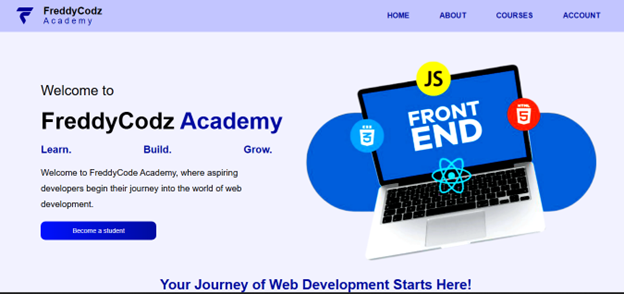

# FreddyCodz-Academy
A responsive educational website built using HTML, CSS, and JavaScript.

Live Demo
Coming Soon...

About
FreddyCodz Academy is a web development learning platform created to help beginners start their journey into front-end web development.
The website features a modern design, responsive layout, and interactive components built entirely with vanilla HTML, CSS, and JavaScript.

Features
- Responsive Design
- Mobile Navigation Menu
- Interactive FAQ Section
- Smooth Animations
- Modern Landing Page
- Clean User Interface

Built With
- HTML5
- CSS3
- JavaScript (Vanilla)

Project Structure
```
📦 FreddyCodz Academy
 ┣ 📂images
 ┣ 📂script
 ┣ 📂styles
 ┣ 📜index.html
 ┣ 📜signup.html
 ┣ 📜terms.html
 ┣ 📜policy.html
```

Preview


Author
**Edoghotu Azibaodiedia Alfred**

- GitHub: https://github.com/YOUR-USERNAME
- LinkedIn: https://www.linkedin.com/in/edoghotu-azibaodiedia-7a7187404

License
This project is open source and available under the MIT License.

https://edoghotuazibaodiedia-hue.github.io/FreddyCodz-Academy/

